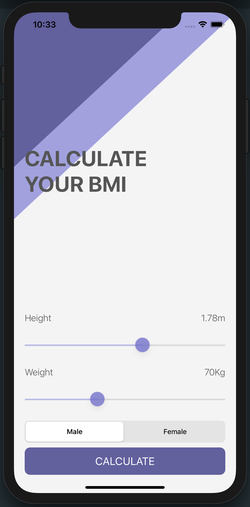
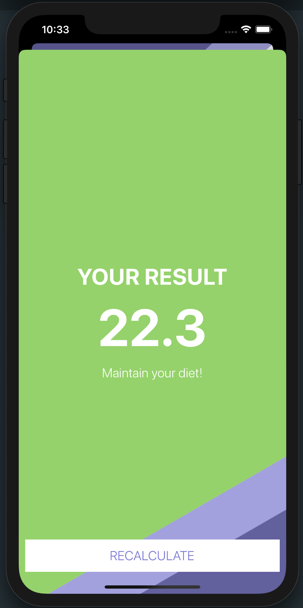

#  BMI Calculator

This app is a simple BMI Calculator that uses UISlider, UISegmentedControl and UIButton

I programmatically created the UI that displays the BMI Result. The background color of BMI Result View changes depending on your result whether you are underweight, normal, pre-obese, obese, etc..

## BMI Calculator View

## BMI Result View

